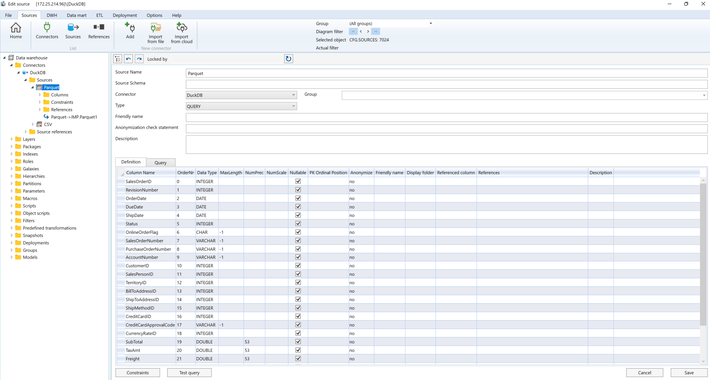

# Sources


PRO TIP: If you're new to AnalyticsCreator we highly recommend make use of the [Source Wizard](source-wizard.md)


The source contains a description of the external data.&#x20;

Each source belongs to a connector.&#x20;

Each source has columns, and references(_Table Keys_) between sources can be defined.&#x20;

To open the source definition, use the "Edit source" option from the source context menu in the navigation tree or diagram.&#x20;

To add a new source, use the "Add new source" option from the source context menu in the navigation tree or diagram. Below is a typical source definition:

\

<figure><figcaption></figcaption></figure>

The properties of sources depend on the connector type and the source type.

\
There are three source types:

* TABLE
* VIEW
* SAP\_DELTAQ
* QUERY\

For the **QUERY** source type, the source window will display an additional tab containing the query definition. You cannot create a source manually.&#x20;

To add a new source, use either the DWH Wizard or the Source Wizard. The only source that can be created manually is the CSV source.

Additionally, you can define source constraints. These constraints will be used during data import to filter incorrect data or generate warnings.

In this example the data with **OrderDate \<DueDate** will be not imported and the message **OrderDate** greater than **DueDate** will be added to the log table. The data with **OrderDate = DueDate** will be imported but according log table entry will be generated.

<figure><figcaption></figcaption></figure>
